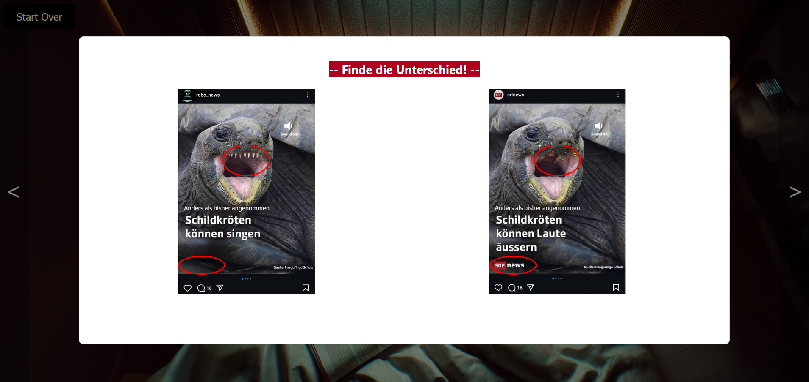

# Find our game!

You can play a demo version of our game at the follwoing address: 

https://valentine14th.github.io/PinkPixels/

*Disclaimer: This game was developped in German to cater to swiss-german children*.

*Disclaimer 2: The game is optimized for a 14'' display, and is not fully adaptable to other display sizes yet.*

# Find the Facts

This project, developped during the **2024 #herHack hackathon**, was selected by **SRG-SSR, the national swiss media coroporation**, as a **finalist and one of the top 2 submissions** for the media literacy challenge, based on its strong alignment with the challenge requirements, particularly its suitability for the target age group and context, as well as the quality of the minimum viable product. 

The challenge focused on finding innovative ways to promote media literacy among primary school children, who are increasingly exposed to digital content online. The goal was to create a solution that could be used in classroom and/or museums. We chose to center our project around the topic of fake news, which young children are especially likely to fall for. 

Our goal was to make the learning process engaging and accessible by gamifying it through an escape room-style experience. To help children concentrate on the content while enjoying the game, we used a format they’re already familiar with: spot-the-difference.

In this game, a child is "trapped" in their room until they complete research for a school poster on turtles. Their parents won’t let them out until the task is done. To gather the necessary information, the player explores the room, interacting with various media elements. The challenge is to distinguish trustworthy sources (such as those from SRG) from fake news and misleading content. Once all reliable information has been collected, the child is free to go play with his friends!

** *Made by the the PinkPixels team* **

## Available Scripts

In the project directory, you can run:

### `npm start`

Runs the app in the development mode.\
Open [http://localhost:3000](http://localhost:3000) to view it in your browser.

The page will reload when you make changes.\
You may also see any lint errors in the console.

### `npm test`

Launches the test runner in the interactive watch mode.\

### `npm run build`

Builds the app for production to the `build` folder.\
It correctly bundles React in production mode and optimizes the build for the best performance.

The build is minified and the filenames include the hashes.\
Your app is ready to be deployed!

